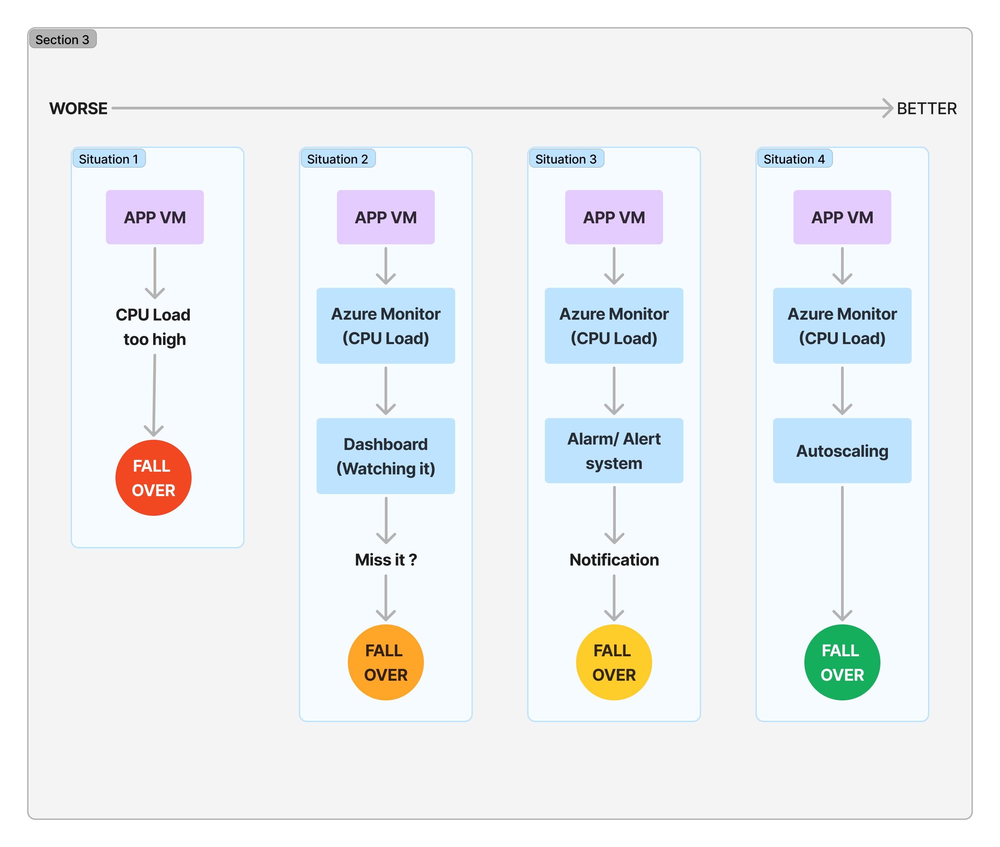
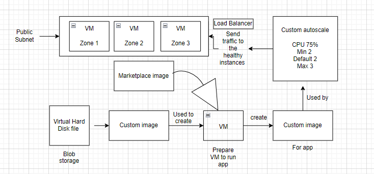

- [How to Create and Manage a VM Scale Set on Azure](#how-to-create-and-manage-a-vm-scale-set-on-azure)
  - [Overview](#overview)
    - [Load Balancer](#load-balancer)
    - [Health Probes](#health-probes)
- [How to connect the VM app after you stop it and start again - using  SSH key](#how-to-connect-the-vm-app-after-you-stop-it-and-start-again---using--ssh-key)
- [Levels of monitoring](#levels-of-monitoring)
- [Dashboard VM](#dashboard-vm)
  - [Steps to Create a VM Scale Set](#steps-to-create-a-vm-scale-set)
  - [Diagram of set scale arcitecture](#diagram-of-set-scale-arcitecture)
    - [Basics](#basics)
    - [Disks](#disks)
    - [Networking](#networking)
    - [Health Monitoring](#health-monitoring)
    - [Advanced](#advanced)
    - [Tags](#tags)
    - [Review and Create](#review-and-create)
  - [Managing Instances in the Scale Set](#managing-instances-in-the-scale-set)
    - [Accessing an Instance via SSH](#accessing-an-instance-via-ssh)
    - [Creating an Unhealthy Instance (for Testing)](#creating-an-unhealthy-instance-for-testing)
    - [Deleting a VM Scale Set and its Related Components](#deleting-a-vm-scale-set-and-its-related-components)
  - [Diagram of How it Works](#diagram-of-how-it-works)


# How to Create and Manage a VM Scale Set on Azure

This document covers how to create an Azure VM Scale Set (VMSS), manage instances, use a load balancer, and test various scenarios such as unhealthy instances. Additionally, we will walk through how to test and connect to the scale set and how to delete it when no longer needed.

---

## Overview

A **VM Scale Set (VMSS)** in Azure allows you to automatically deploy and manage a set of identical VMs. You can scale the number of VMs in or out manually, based on defined rules, or in response to demand. VM Scale Sets are crucial for high availability and handling fluctuating workloads.

### Load Balancer
A **Load Balancer** distributes incoming network traffic across multiple VM instances in the scale set. This ensures that no single VM is overwhelmed with traffic and improves the reliability and availability of your services. Load balancers are needed to ensure:
- Traffic is balanced across multiple instances.
- Redundancy in case of VM failure.
- Health monitoring and automatic failover for unhealthy instances.

### Health Probes
Azure uses **health probes** to monitor the state of each instance in the scale set. If an instance is unhealthy (e.g., does not respond to HTTP requests), the load balancer stops sending traffic to it until it is marked healthy again.

---

# How to connect the VM app after you stop it and start again - using  SSH key
 
1. Connect the `VM with SSH key`
2. To see the `repo/app`- need to be in root directory  -> `cd /repo/app`
3. Stop all processes -> `pm2 stop all`
4. To start the app -> `sudo pm2 start app.js`


---
# Levels of monitoring



---

# Dashboard VM
 
1. In the `VM` -> `Overview`-> scroll down to where is:
* Properties--Monitoring--Capabilities--Recommendations--Tutorials
2. Select `Monitoring`
3. In the monitoring window -> `Platform metrics` -> pin the metrics that we need(e.g. CPU, Disk bytes)
4. `Click pin`-> `create new`-> type(private/pubic) -> `Dashboard name`-> `Pin`


---

## Steps to Create a VM Scale Set

## Diagram of set scale arcitecture 



### Basics

1. **Search** for "Scale Set" in the top Azure search bar and select **Virtual Machine Scale Set**.
2. **Assign a Resource Group**: Choose an existing resource group or create a new one.
   - Example: `tech264`
3. **Set a Name for the VMSS**: Choose a descriptive name for the scale set.
   - Example: `tech264-raiyan-vm-scale-sets`
4. **Region**: Choose the region closest to your target audience or users.
   - Example: `(Europe) UK South`
5. **Availability Zones**: Select all 3 availability zones to ensure high availability.
6. **Orchestration Mode**: Select `Uniform`.
7. **Security Type**: Set it to `Standard`.
8. **Scaling**: Select `Autoscaling` and click **Configure**.
   - Set **Maximum Instances** to **3**.
   - Set **CPU Threshold** to **75%**.
   - Click **Save** to apply scaling rules.
9. **Select an Image**: Under "See all images," select "My Images" and choose the image you prepared for your application.
10. **Authentication**: Change the username and select your SSH public key stored in Azure for secure access.

---

### Disks

1. Set **OS Disk Type** to `Standard SSD (locally redundant storage)` for better performance and cost-effectiveness.

---

### Networking

1. **Virtual Network**: Select your virtual network and subnet.
2. **Network Interface**:
   - Enable `SSH (22)` and `HTTP (80)` ports to allow secure access and web traffic.
   - Ensure **Public IP Address** is **disabled** as the load balancer will handle public traffic.
3. **Create a Load Balancer**:
   - Name the load balancer using a convention that helps identify it easily (e.g., `tech264-raiyan-sparta-app-lb`).
   - Azure will automatically handle traffic balancing between VMs in the scale set.

---

### Health Monitoring

1. **Enable Health Probes**: Check the box for **Application Health Monitoring**.
2. **Automatic Repairs**: Enable automatic repairs to ensure that unhealthy VMs are automatically replaced.

---

### Advanced

1. **Enable User Data** and input a custom script to manage your application startup. For example:
   
   ```bash
   #!/bin/bash
   cd /repo/app
   pm2 stop all
   pm2 start app.js
   echo "App started with PM2"
   ```

This script ensures that your application starts automatically on each VM instance.

---

### Tags

1. Add **tags** for owner identification and cost tracking.

---

### Review and Create

1. **Review** all your settings to ensure they are correct.
2. **Click Create** to deploy your VM Scale Set.

---

## Managing Instances in the Scale Set

### Accessing an Instance via SSH

1. Open your VM Scale Set in the Azure portal.
2. Select **Instances** from the left-hand menu.
3. Choose a specific instance and copy its private IP address.
4. Use SSH to access the instance:
   
   ```bash
   ssh -i <your-private-key> azureuser@<instance-private-ip>
   ```

   Ensure you have your SSH key configured properly in Azure and on your local machine.

---

### Creating an Unhealthy Instance (for Testing)

You can simulate an unhealthy instance by manually overloading the CPU or stopping a critical service like your web application or database.

1. **Overload the CPU**:
   - Install Apache Bench (AB) if not already done:
     ```bash
     sudo apt-get install apache2-utils
     ```
   - Run a load test to create CPU spikes:
     ```bash
     ab -n 100000 -c 1000 http://localhost/
     ```
2. **Stop a Critical Service** (e.g., your web app):
   ```bash
   pm2 stop app.js
   ```
3. The load balancer's health probe will detect this instance as **unhealthy** because it is no longer serving traffic or has high CPU usage. Traffic will stop being routed to this instance.

---

### Deleting a VM Scale Set and its Related Components

1. **Go to Azure Portal** and navigate to **Virtual Machine Scale Sets**.
2. **Select** the Scale Set you wish to delete.
3. **Click Delete** and confirm the deletion.
4. To ensure all components are removed, delete related resources such as:
   - The **load balancer** created during VMSS setup.
   - The **virtual network** if it was created specifically for this setup.
   - The **resource group** that contains all related components (if no longer needed).

**Found cli commands saved help me after**
```bash
# Delete a VM Scale Set using the Azure CLI
az vmss delete --name <scale-set-name> --resource-group <resource-group-name>
# Delete the associated load balancer
az network lb delete --name <load-balancer-name> --resource-group <resource-group-name>
# Delete the virtual network (if needed)
az network vnet delete --name <vnet-name> --resource-group <resource-group-name>
```

This ensures the entire infrastructure is removed and no lingering resources remain.

---

## Diagram of How it Works

VM Scale Set with a load balancer:

```
         +--------------------+
         |    Load Balancer   |
         +--------------------+
                   |
   -------------------------------------
   |                 |                |
   VM 1           VM 2            VM 3
   (Healthy)      (Unhealthy)     (Healthy)
```

- The load balancer distributes traffic across VM instances.
- If one VM is marked **unhealthy** (due to high CPU usage, application failure, etc.), the load balancer stops routing traffic to it.


---


